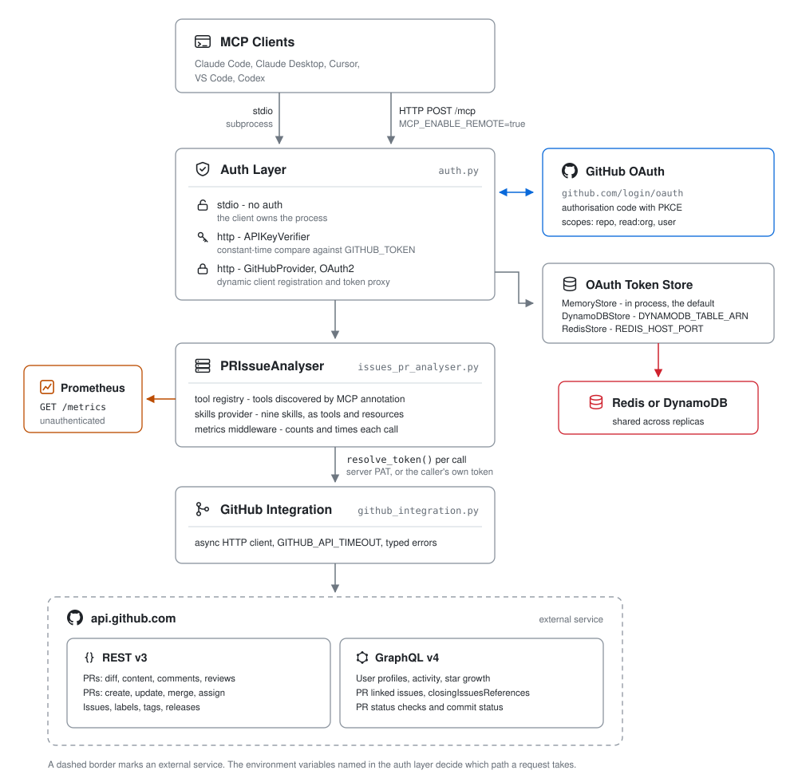

# Architecture

## Layers

| Layer | Module | Responsibility |
|-------|--------|----------------|
| MCP client | - | Connects over stdio, or HTTP POST to `/mcp` when `MCP_ENABLE_REMOTE` is set |
| Auth layer | `auth.py` | Picks no auth, `APIKeyVerifier` or `GitHubProvider`, and resolves the token for each call |
| Token store | `auth.py` | `MemoryStore` by default, `RedisStore` when `REDIS_HOST_PORT` is set |
| Server | `issues_pr_analyser.py` | FastMCP server: tool registration, skills provider, metrics middleware, request routing |
| GitHub integration | `github_integration.py`, `activity.py` | All GitHub API calls, REST v3 and GraphQL v4 |

## Request path

1. The client opens a session. Over stdio it launches the server as a subprocess and there is no transport auth, because the client already owns the process. Over HTTP the auth layer either compares the bearer token against `GITHUB_TOKEN` with a constant-time comparison, or runs the GitHub OAuth2 authorisation code flow with PKCE.
2. `resolve_token` returns the token for the call: the server's `GITHUB_TOKEN` in static mode, the caller's own `gho_*` token in OAuth2 mode. This is the only difference the tools see between the two modes.
3. `PRIssueAnalyser` routes the call to a registered tool. Tools are discovered from the MCP annotations on the integration's public methods, so adding an annotated method registers a tool. Every call passes through the metrics middleware, which counts and times completed calls.
4. `GitHubIntegration` issues the API request over an async HTTP client bounded by `GITHUB_API_TIMEOUT`. Diffs, comments, merges, issues, labels, tags and releases go over REST v3. User search, activity, PR linked issues, PR status checks and star growth go over GraphQL v4.

## Tool categories

1. **PR management** - fetch diffs, content, linked issues and CI status; create, review, merge and update
2. **Issue tracking** - create, update, list and assign; list repository labels
3. **Release management** - tags and releases
4. **User search** - profile lookup, contribution activity and star growth via GraphQL

## Auth layer

The three rows in the diagram are mutually exclusive and selected at startup, not per request:

| Selected when | Verifier | Identity used |
|---------------|----------|---------------|
| `MCP_ENABLE_REMOTE` unset | none | Server's `GITHUB_TOKEN` |
| `MCP_ENABLE_REMOTE` set, no `GITHUB_OAUTH_*` | `APIKeyVerifier` | Server's `GITHUB_TOKEN`, shared by every caller |
| `MCP_ENABLE_REMOTE` set, all `GITHUB_OAUTH_*` | `GitHubProvider` | Each caller's own GitHub token |

In OAuth2 mode the server acts as its own authorisation server: it accepts dynamic client registration, proxies GitHub's authorisation code flow, and issues JWTs signed with a key derived from `JWT_SIGNING_KEY` or the OAuth client secret. Audit trails and rate limits then follow the individual user rather than the server.

## Token store

OAuth client registrations and token state live in the store returned by `build_token_store()`. With a single replica the in-process `MemoryStore` is enough, though clients re-register after every restart. With more than one replica, or to survive restarts, set `REDIS_HOST_PORT`. When `GITHUB_OAUTH_BASE_URL` is also set, keys are prefixed with a hash of that URL, so several deployments can share one Redis instance without colliding.

## Observability

The metrics middleware wraps every tool call and the server serves `GET /metrics` on the same port as `/mcp`. That route is registered outside the auth layer, so a scraper needs no credentials. See [Metrics](./metrics.md).
